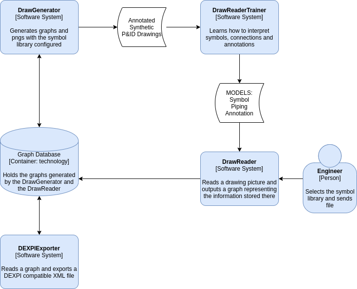

# Title
Drawreader: Piping and instrumentation drawing reader

## Header
- Author: Jesus Gazol jgaz@
- Core Technologies: python, deep learning, vision, P&ID, graph databases

## Abstract
Piping and instrumentation drawings are fascinating and a core discipline in many different 
engineering fields. Unluckily, they are pretty bad for machine interpretation, the information
stored in them is a black box for computers and this stops automation processes that could use them
in order to deal with more complex scenarios.

The idea here is to build an AI system that can learn to read a significant corpus of P&ID diagrams, using
a synthetic set of annotated data, produced by the system itself and increased by augmentation.
 The resulting representation of the diagram will be a graph that then could be exported to the DEXPI standard 
 specification (see references)

## Description

### C4 Diagram

### Draw Generator (/generator)

I assume that it is possible to create diagrams synthetically that are close enough to real diagrams, this is probable
an assumption that needs check.

Given the above, the generator will first construct a random graph of an installation, the graph will have:
- Symbols from a library (Nodes)
- Pipes (Pipe Vertex)
- Annotations (Child Nodes isolated or connected with parents with "Child Vertex")

Once the graph is done, there will be a render process, the render process should be non deterministic, similar to 
[ForceAtlas2](https://github.com/gephi/gephi/wiki/Force-Atlas-2) but making sure that Annotations stay close to 
their parents.

There will be a data augmentation process that will generate images with the following transformations:
- Rotation
- Mirroring
- Scaling
- Overlap

Finally both the render and the graph information will be combined to generate the dataset needed for the model 
training performed in the DrawReaderTrainer.

### Draw Reader Trainer (/trainer)

This component will be responsible for generating the ML models that will eventually turn PGNs into a graph.

There are four different tasks that these models will need to perform:
- Symbol location and identification: X,Y,Height,Width,Type, probably a Yolo net for this.
- Annotations location and content: X,Y,Height,Width,Text, might be the same Yolo net.
- Symbol and pipelines annotation association: (Symbol1,Annotation3),(Pipeline1,Annotation2), this should be straight forward knowing the symbol and annotation coordinates and types/contents.
- Pipelines: Start(X,Y), End(X,Y). Connected symbols (Symbol1, Symbol2, Pipe Vertex), absolutely no clue, research needed.

There are quite good models in the literature for tasks 1 and 2, but pipeline identification seems to me like a new problem.
 
The models will be tested for accuracy, hopefully architectures that can learn fast a new set of symbols will be found 
as the symbol library is usually not standard. 

### Draw Reader (/reader)

This component will expose the ML models learned and perform the "digitalization".
It will be able to apply a number of ML models versions on the same set of documents, and allow an easy comparison
between the results in terms of accuracy.  

AzureML looks like a possible tool for Equinor, assuming the models are going to be designed in Keras.  

### DEXIP Exporter (/dexpie_exporter)

This piece is quite large as the standard is rather long (300) pages. The initial idea is to be able to fill in as 
much information as possible from the graphs generated into the target XML schema.

There are some tools that will read documents with this schema (Autocad, etc...) and there is some work done in 
the [Dexpi GitLab page](https://gitlab.com/dexpi). 

### Graph database (/graph_db)

This will be the storage engine for the generated graphs and the read graphs too. A specialized solution could help
analytics, possibilities here are rather large: from describing what kind of graphs define P&IDs, 
finding patterns in design of the different components, assembly of larger P&IDs and complex automation.

In addition, it could help data crossing with other data sources, allowing for improvements in data integrity. 

## References

- [DEXPI specification](https://gitlab.com/dexpi/Specification/raw/master/specification/DEXPI%20Specification%201.2.pdf)
- [DEXPI training test cases](https://gitlab.com/dexpi/TrainingTestCases)
- [BilFinger solution](https://digitalnext-bilfinger.com/solutions/pidgraph)

